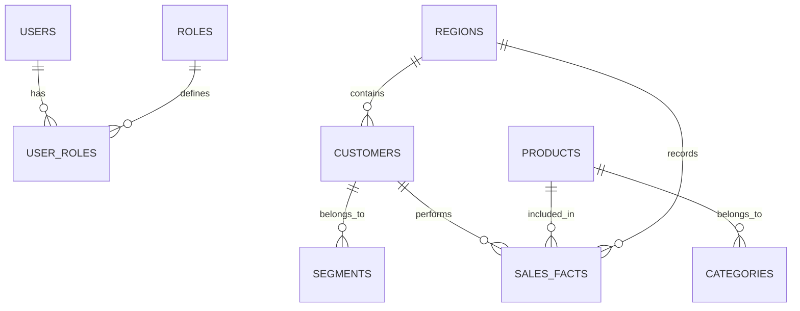

# OrionLedger / Mushtari: SQL Database Schema Design

This document outlines the proposed relational schema for the **PostgreSQL** instance. This schema complements the high-volume Cassandra event store by managing complex entities, relationships, and metadata.

## 1. Entity-Relationship Overview

The design follows a **Snowflake/Star Schema** hybrid to support both operational workflows (CRMs, User Management) and analytical drill-downs (Product Hierarchy, Customer Segments).

---

## 2. Table Definitions

### 2.1 Identity & Access Management (IAM)
Manages internal platform users (Analyst, Admin, Manager).

| Table | Columns | Description |
| :--- | :--- | :--- |
| `users` | `id (PK)`, `email`, `password_hash`, `full_name`, `is_active`, `last_login`, `created_at` | Core user account details. |
| `roles` | `id (PK)`, `name`, `permissions (jsonb)` | Definition of system roles. |
| `user_roles` | `user_id (FK)`, `role_id (FK)` | Association between users and roles. |

### 2.2 Product Metadata (Dimensions)
Enriches the raw `product_id` found in sales records with descriptive attributes.

| Table | Columns | Description |
| :--- | :--- | :--- |
| `categories` | `id (PK)`, `name`, `parent_id (FK)`, `description` | Hierarchical product organization. |
| `products` | `id (PK)`, `sku_code (unique)`, `name`, `category_id (FK)`, `base_price`, `weight`, `dimensions`, `status (active/retired)` | Detailed SKU specifications. |

### 2.3 CRM & Marketing (Dimensions)
Manages the "Who" and "Where" of transactions.

| Table | Columns | Description |
| :--- | :--- | :--- |
| `customers` | `id (PK)`, `external_id`, `name`, `email`, `region_id (FK)`, `segment_id (FK)`, `acquisition_channel`, `ltv (lifetime value)` | Core customer profiles. |
| `segments` | `id (PK)`, `name`, `description`, `min_spend`, `max_spend` | Marketing logic for grouping customers. |
| `regions` | `id (PK)`, `name`, `country_code`, `currency`, `timezone` | Geographic and localized settings. |

### 2.4 AI Content Management
Stores automated observations and generated documentation.

| Table | Columns | Description |
| :--- | :--- | :--- |
| `insights` | `id (PK)`, `title`, `category`, `impact (low/mod/high)`, `description`, `visual_schema (jsonb)`, `created_at` | Automated analytical observations. |
| `reports` | `id (PK)`, `name`, `report_type (PDF/XL)`, `file_path`, `author_id (FK)`, `file_size`, `created_at` | References to generated artifacts. |

### 2.5 Bridge Layer (Cross-Database Reference)
While actual sales records live in Cassandra, we keep a "Shadow Fact" or a "Reference Log" in SQL for reporting purposes if needed.

| Table | Columns | Description |
| :--- | :--- | :--- |
| `sync_logs` | `id (PK)`, `source_db`, `table_name`, `records_processed`, `status`, `duration`, `executed_at` | Audit trail for ETL pipeline runs. |

---

## 3. Design Philosophy

1.  **Normalization**: The SQL schema is highly normalized (3NF) to ensure data integrity for critical business entities.
2.  **Shadow IDs**: Every table includes an `external_id` or uses the same `id` as the source systems (Kafka/Cassandra) to act as a join key during application-level data merging.
3.  **JSONB for Flexibility**: Tables like `products` and `roles` use PostgreSQL's `JSONB` type for non-standard attributes, allowing the schema to evolve without frequent migrations.
4.  **Indexing Strategy**: 
    *   B-tree indexes on `sku_code`, `email`, and `external_id` for fast lookups.
    *   GIN indexes on JSONB fields for flexible attribute searching.
